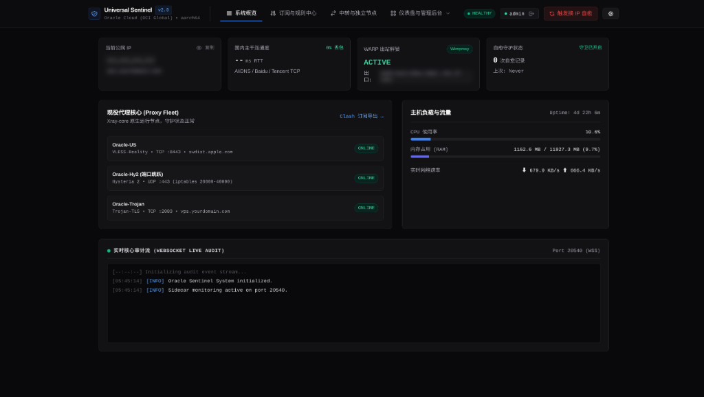
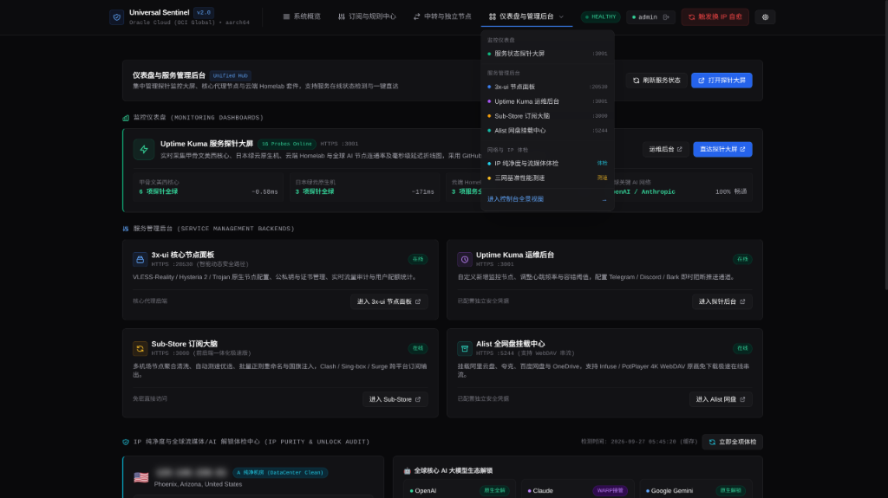
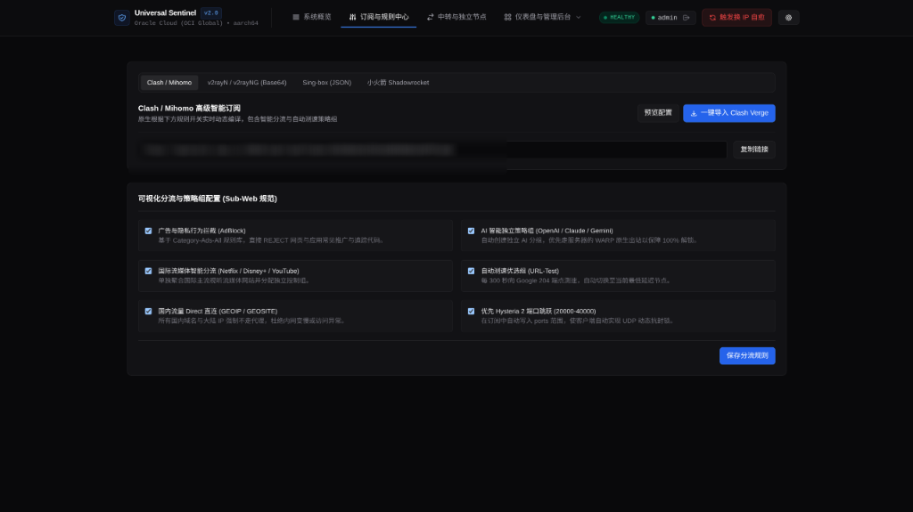
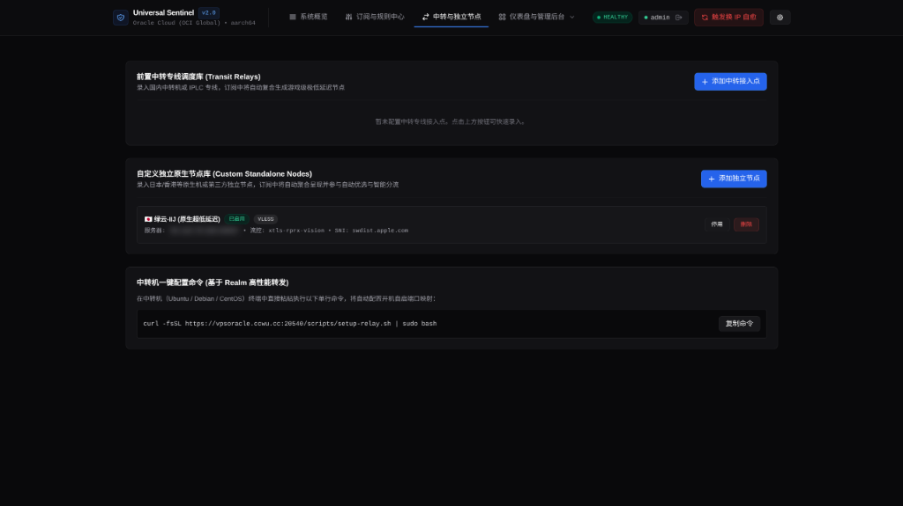

# VPSentinel

<div align="center">



**为境外 Linux VPS 量身打造的自动换 IP 自愈守卫、多协议订阅聚合引擎与云端家庭实验室中枢**

[](LICENSE)
[](https://www.python.org/)
[](https://fastapi.tiangolo.com)
[](https://www.docker.com/)
[](https://docs.oracle.com/en-us/iaas/Content/API/SDKDocs/pythonsdk.htm)
[](https://developers.cloudflare.com/api/)

[特性速览](#特性速览) • [极速部署](#极速部署) • [安全防御加固](#渐进式安全防御加固体系-anti-sniffing--security-hardening) • [进阶玩法: 家庭实验室](#进阶玩法-云端家庭实验室-homelab) • [订阅引擎](#订阅引擎与客户端适配) • [中转与独立节点](#链式中转与外部独立节点) • [告警配置](#多渠道即时告警) • [常见排查 (FAQ)](#常见问题排查-faq)

</div>

---

## 项目简介

玩境外 VPS（特别是甲骨文云 Oracle Cloud、搬瓦工、RackNerd 等）常遇到几个恶心的问题：
* **IP 被封**：SSH 连不上、节点全断，手动去控制台换 IP 再改 Cloudflare DNS，费时费力。
* **分流限制**：机房原生 IP 经常被 ChatGPT、Claude 或流媒体拦截，打不开或者报地区不支持。
* **客户端难配**：软路由 OpenClash、电脑 v2rayN、手机小火箭配置各不相同，容易遇到 DNS 污染或死锁。
* **机器吃灰**：机器配置不低（尤其甲骨文 ARM 4核24G/2核12G），只跑代理浪费资源。

**VPSentinel** 把这些杂事整合成一套开箱即用的自动化系统：
1. **自动换 IP 自愈**：国内探针连续检测超时，自动通过云商 API 更换被封公网 IP，秒级同步 Cloudflare A 记录，发通知到手机。
2. **全协议统一订阅**：直连 3x-ui 数据库，自动生成 Clash/OpenClash、Sing-box、v2rayN、小火箭订阅，规则全自动分流。
3. **进阶云端 Homelab**：内核级 TCP BBR 缓冲区调优、WARP 智能分流（ChatGPT/Claude/流媒体洗白）、Uptime Kuma 监控大屏、Alist 4K 网盘串流、Sub-Store 订阅清洗大脑。

---

## 特性速览

| 模块 | 核心功能 |
| :--- | :--- |
| **全自动换 IP 自愈** | 支持甲骨文云（OCI 原生秒级换 IP）、通用 VPS（多探针监控+告警）、自定义脚本 Hook。换完自动改 Cloudflare DNS。 |
| **智能订阅引擎** | 自动提取 VLESS-Reality、Hysteria 2、Trojan。输出直连 IP 节点，免疫国内 DNS 污染，彻底解决软路由 Fake-IP 冲突。 |
| **渐进式安全防御加固** | **Host Guard** 域名嗅探拦截（裸 IP 扫描直接丢弃返回空白 404）、根路径 `/` 逼真 Nginx 欢迎页伪装、安全隐蔽路径（`/sentinel`）、加盐哈希管理员认证网关、多协议订阅 Token 防抓取，以及 Cloudflare CDN 代理就绪（2096 端口支持）。 |
| **IP 纯净度与解锁体检** | 实时公网画像、Scamalytics 权威欺诈分与风控评估、4 项 DNSBL 黑名单洁净监测，以及 OpenAI (ChatGPT)、Anthropic (Claude)、Gemini、Netflix、YouTube Premium、Disney+ 解锁状态体检。 |
| **多节点三网性能测速** | 集成原生测速内核与国内电信、联通、移动骨干节点链路往返延迟（RTT）、抖动、丢包率与全带宽并发压测，输出综合链路评级。 |
| **多节点与中转聚合** | 支持挂载外部独立节点（如日本原生机、香港低延迟机）及国内跳板机（Realm 端口转发），自动合并到统一订阅中。 |
| **WARP 双栈智能洗白** | 本地 Wireproxy 用户态 WireGuard，仅针对 OpenAI、Anthropic、Netflix、Disney+ 走 WARP，YouTube/常规网页直连千兆带宽。 |
| **BBR + TCP 暴力调优** | FQ 队列、64MB 发送/接收缓冲区、空闲不降速（`tcp_slow_start_after_idle=0`），彻底跑满跨洋高延迟带宽。 |
| **云端 Homelab 套件** | 预置 Docker 编排：Uptime Kuma 颜值监控、Alist 4K 网盘挂载、Sub-Store 订阅大脑（内置前后端一体化）。 |
| **即时阻断告警** | 支持 Telegram Bot、Discord Webhook、Bark (iOS) 及自定义 Webhook，被墙/自愈/换 IP 即刻推送到手。 |
| **工业风控制台** | 实时 CPU/内存/磁盘/网络图表、WARP 状态检测、敏感 IP/域名一键高斯模糊防截屏泄露。 |

---

## 极速部署

### 方式一：Web 首次启动向导（推荐，零门槛）

服务安装后，使用浏览器访问安全路径：
```text
https://<你的域名或IP>:20540/sentinel
```
首次打开会自动进入 **6 步交互式向导**（默认管理员账号 `admin`，初始密码 `mNq7gQGr`）：
1. **环境检测**：自动识别云厂商与 CPU 架构（`x86_64` / `aarch64`）。
2. **运行模式**：甲骨文模式一键生成 RSA 密钥对并打印公钥；通用 VPS 模式开启监控告警。
3. **Cloudflare 联动**：输入 Token，自动拉取名下所有域名下拉选择，自动配 A 记录。
4. **核心节点生成**：一键写入 VLESS-Reality (:8443)、Hysteria 2 (:443 端口跳跃) 与 Trojan (:2083)。
5. **通知配置**：填入 Telegram / Discord / Bark 凭据，网页端直接点按钮发测试消息。
6. **启动守护**：点击保存，守护进程与订阅引擎直接就绪。

---

### 方式二：终端一键安装（SSH 用户）

```bash
curl -fsSL https://raw.githubusercontent.com/imprprpr/vpsentinel/main/scripts/install.sh | sudo bash
```

脚本会自动放行防火墙端口、开启 BBR、配置 Hysteria 2 端口跳跃（`UDP 20000:40000 -> 443`），并引导输入 Cloudflare Token 与通知凭据。

后续随时可以重新运行向导：
```bash
sudo python3 /opt/vpsentinel/scripts/wizard.py
```

---

## 渐进式安全防御加固体系 (Anti-Sniffing & Security Hardening)

针对网络空间测绘引擎（Shodan / Censys / ZoomEye）的无差别端口扫描、协议嗅探与 GFW 针对管理端口的主动探测，VPSentinel 内置了三层立体防御体系：

### 1. 方案 1：Host Guard 域名嗅探与直接 IP 扫描防御
* **直接 IP 探测拦截**：任何通过裸 IP（如 `https://129.146.230.81:20540/` 或 `https://129.146.230.81:2096/`）发起的扫描，中间件直接丢弃并返回 **0 字节空白 404**，不泄露任何 Server 签名与页面信息。
* **白名单域名校验**：仅允许通过配置的受信域名（如 `vpsoracle.ccwu.cc`）以及本机回环接口访问。

### 2. 方案 2：隐蔽路径 + 逼真伪装页 + 管理员鉴权体系
* **根路径欺骗伪装 (`/`)**：访问域名根路径 `https://vps.yourdomain.com:20540/` 返回逼真的标准 **Debian/Ubuntu Nginx 1.22.1 欢迎页**，使外网测绘扫描器误判为未配置的空闲 Web 服务。
* **隐蔽安全路径 (`/sentinel`)**：控制台迁移至安全路径，只有访问 `https://vps.yourdomain.com:20540/sentinel` 才会唤起控制中枢。
* **管理员身份认证网关**：
  * **默认凭据**：账号 `admin`，密码 `mNq7gQGr`（首次登入后可在设置中随时修改）。
  * **加盐哈希 & 30 天 HttpOnly 会话**：登录后自动下发安全 Cookie 会话，敏感运维 API（触发换 IP、保存配置、节点管理、测速）严格鉴权，未登录直接 401。
* **多协议订阅保护 (Sub Token Guard)**：
  * `/sub/clash`、`/sub/v2ray`、`/sub/singbox` 必须携带 `?token=<sub_token>` 凭据或处于管理员登录状态。
  * 外网探测无 Token 访问直接返回 **403 Forbidden**，杜绝节点信息与订阅流量被爬取。

### 3. 方案 3：Cloudflare CDN / WAF 代理就绪 (2096 端口)
* **放行并映射端口 2096**：系统支持通过 Cloudflare 免费 HTTPS 代理端口（2096）进行访问，流量无缝转发至 20540。
* **真实访客 IP 还原**：自动解析 `CF-Connecting-IP` 与 `X-Forwarded-For`。
* **随时开启 CDN**：如果未来希望彻底隐藏甲骨文源站公网 IP，只需在 Cloudflare DNS 将域名开启小黄云（Proxy），即可通过 `https://vps.yourdomain.com:2096/sentinel` 享受 Anycast 全球 CDN 保护。

---

## 进阶玩法: 云端家庭实验室 (Homelab)

为彻底压榨 VPS 性能（尤其甲骨文 ARM 12G/24G 大内存机），系统提供了全套进阶优化与容器服务。

<div align="center">



</div>

### 1. BBR + TCP 暴力网络加速
高延迟链路（美西到国内 140~200ms）最大的瓶颈是 Linux 默认的 TCP 缓冲区过小，导致滑动窗口受限跑不满带宽。

一键优化配置：
```bash
sudo bash -c 'cat << "EOF" > /etc/sysctl.d/99-tcp-bbr-tuning.conf
fs.file-max = 1000000
net.core.default_qdisc = fq
net.ipv4.tcp_congestion_control = bbr
net.ipv4.tcp_window_scaling = 1
net.ipv4.tcp_slow_start_after_idle = 0
net.ipv4.tcp_fastopen = 3

# TCP 缓冲区拉大到 64MB
net.core.rmem_max = 67108864
net.core.wmem_max = 67108864
net.core.rmem_default = 65536
net.core.wmem_default = 65536
net.ipv4.tcp_rmem = 4096 87380 67108864
net.ipv4.tcp_wmem = 4096 65536 67108864

# 队列与连接复用
net.core.somaxconn = 65535
net.core.netdev_max_backlog = 100000
net.ipv4.tcp_max_syn_backlog = 8192
net.ipv4.tcp_max_tw_buckets = 50000
net.ipv4.tcp_tw_reuse = 1
net.ipv4.tcp_fin_timeout = 15
EOF
sysctl -p /etc/sysctl.d/99-tcp-bbr-tuning.conf'
```

---

### 2. Cloudflare WARP 智能双栈分流 (AI / 流媒体 100% 解锁)
不要将 VPS 全局流量走 WARP（会导致 YouTube、测速降速）。正确的做法是 **用户态 SOCKS5 + Xray 智能分流**：

* **底层运行**：`wireproxy` 监听 `127.0.0.1:40000`，获取 Cloudflare Anycast IPv6 出口。
* **分流规则**：
  * 常规网页、YouTube、测速：美西千兆网络直连出站。
  * `geosite:openai`, `geosite:anthropic`, `domain:chatgpt.com`, `domain:claude.ai`, `geosite:netflix`, `geosite:disney`：分流至 `127.0.0.1:40000` 洗白出站。

---

### 3. Docker 容器套件统一编排
所有容器统一部署在 `/opt/containers/`：

```yaml
# /opt/containers/docker-compose.yml
services:
  # 1. 探针监控大屏
  uptime-kuma:
    image: louislam/uptime-kuma:1
    container_name: uptime-kuma
    restart: unless-stopped
    ports:
      - "3001:3001"
    volumes:
      - /opt/containers/uptime-kuma/data:/app/data

  # 2. 全网盘挂载串流
  alist:
    image: xhofe/alist:latest
    container_name: alist
    restart: unless-stopped
    ports:
      - "5244:5244"
    volumes:
      - /opt/containers/alist/data:/opt/alist/data
    environment:
      - PUID=0
      - PGID=0
      - UMASK=022

  # 3. 私有订阅大脑 (前后端一体化版，免外部依赖)
  sub-store:
    image: xream/sub-store:latest
    container_name: sub-store
    restart: unless-stopped
    ports:
      - "3000:3000"
    volumes:
      - /opt/containers/sub-store/data:/opt/app/data
    environment:
      - SUB_STORE_BACKEND_MERGE=true
      - SUB_STORE_FRONTEND_BACKEND_PATH=/api
```

启动命令：
```bash
cd /opt/containers && docker compose up -d
```

#### 服务矩阵与端口清单：

| 服务 | 端口 | 默认账号密码 / 初始化方式 | 用途 |
| :--- | :--- | :--- | :--- |
| **Uptime Kuma** | `3001` | 首次打开网页直接注册管理员 | 监控多台 VPS、家庭宽带、博客的存活与延迟折线图。提供 `/status/services` 公开状态页。 |
| **Alist** | `5244` | 账号 `admin`，密码查日志或命令重置 | 挂载阿里云盘、夸克、百度网盘、OneDrive，WebDAV 4K 在线串流播放。 |
| **Sub-Store** | `3000` | 免密直接打开全功能 Web 页面 | 订阅清洗、多机场聚合、正则重命名、国旗 Emoji 注入。 |

> **Alist 密码重置命令**：`docker exec -it alist ./alist admin random` 或 `docker exec -it alist ./alist admin set 新密码`。

#### 探针与监控自动化配置 (Uptime Kuma)

配套脚本 `scripts/setup-uptime-kuma.py` 支持一键初始化全部监控项并注入 GitHub Dark 风格状态页：
* **监控矩阵**：自动化录入甲骨文美西节点（Ping/20540/20530/8443/443/2083）、日本绿云节点（Ping/Reality/SSH）、Homelab 套件与全球 AI 节点（OpenAI/Anthropic/Cloudflare）。
* **前端风格**：深度适配 GitHub/Linear 极简暗黑工程美学（`#0d1117` 主色调、细分卡片边框、等宽字体指标展示），避免浮夸渐变与设计冗余。
* **一键配置命令**：
  ```bash
  python3 scripts/setup-uptime-kuma.py
  ```
  状态页访问路径：`http://<VPS-IP>:3001/status/services`

---

## 订阅引擎与客户端适配

在控制面板的【多协议订阅中心】可直接获取各客户端专用链接与动态策略组规则：

<div align="center">



</div>

| 客户端 | 订阅路径 | 特性 |
| :--- | :--- | :--- |
| **Clash / OpenClash** | `/sub/clash` | 自动写入节点真实公网 IP，彻底去除 Fake-IP 劫持，含 DoH 安全回退与国内直连分流 |
| **v2rayN / v2rayNG** | `/sub/v2ray` | 标准 Base64 聚合节点池，直连 IP 握手 |
| **Sing-box** | `/sub/singbox` | 1.8+ 规范 JSON 配置，包含 selector / urltest 组 |
| **Shadowrocket (小火箭)**| `/sub/shadowrocket`| 手机端直接扫码导入 |

### 软路由 OpenClash 避坑要点
1. **防国内 DNS 投毒**：国内公共 DNS（如 `223.5.5.5`）可能对自建 DDNS 域名投毒返回 `127.0.0.1`。VPSentinel 订阅中节点 `server` 字段直接写入 VPS 真实公网 IP，完全绕过国内 DNS 污染。
2. **Fake-IP 分流冲突**：Clash 的 Fake-IP 池通常为 `198.18.0.1/16`。规则库严禁将 `198.18.0.0/15` 设为 `DIRECT, no-resolve`，否则外网请求全部会被当成保留 IP 直接丢入 WAN 光猫黑洞。
3. **管理面板绕行**：请在 OpenClash 后台将 VPSentinel（`20540`）与 3x-ui（`20530`）端口加入“不走代理的 WAN 端口”，防止管理流量回环。

---

## 链式中转与外部独立节点

<div align="center">



</div>

### 1. 国内中转机一键配置 (Realm)
在中转跳板机（国内轻量云、NAT VPS、公网软路由）上执行：
```bash
curl -fsSL https://<你的域名>:20540/scripts/setup-relay.sh | sudo bash -s -- <目标VPS公网IP或域名>
```
然后在控制台【中转与独立节点】页面登记中转机 IP 与端口，客户端更新订阅即可看到 `[中转] Hy2专线`、`[中转] Reality专线`。

### 2. 外部原生独立节点聚合 (Custom Standalone Nodes)
可将任意第三方 VPS（如日本原生机、香港直连机）聚合进同一订阅：
* **Web 端**：控制台【中转与独立节点】-> 点击【添加独立节点】-> 粘贴分享链接（`vless://`, `hysteria2://`, `trojan://`, `ss://`）。
* **CLI 端**：
  ```bash
  python3 /opt/vpsentinel/scripts/add-custom-node.py "<节点链接>"
  ```

> **小内存与 NAT 机器部署技巧**：
> * 针对 64MB/128MB 极限小鸡（如 GreenCloud Podman 容器），使用配套脚本 `scripts/setup-japan-node.sh`，自带磁盘串行提取、自动挂载 Swap 与 `GOMEMLIMIT=40MiB` 内存封顶，杜绝 OOM 崩溃。
> * 针对 NAT VPS，部署时可直接传参指定公网映射端点：
>   ```bash
>   EXT_IP="85.113.70.183" EXT_PORT="26554" bash scripts/setup-japan-node.sh
>   ```

---

## 多渠道即时告警

节点遭遇 GFW 阻断、换 IP 流程启动、Cloudflare 记录更新或失败时，毫秒级推送卡片至手机：

* **Telegram Bot**：填入 `@BotFather` 生成的 `bot_token` 和你的 `chat_id`。
* **Discord Webhook**：频道设置 -> 整合 -> 创建 Webhook 复制 URL。
* **Bark (iOS)**：App Store 下载 Bark，填入首页显示的 `Device Key`。
* **推送测试**：控制台右上角【设置】面板内有【发送测试推送】按钮，无需等被墙即可现场测试。

---

## 配置文件参数说明

配置文件路径：`/opt/vpsentinel/config.json`

```json
{
  "provider": {
    "type": "auto",            // auto(自动探测) / oracle(甲骨文) / generic(通用VPS) / hook(自定义脚本)
    "hook_cmd": ""             // type为hook时触发的本地换IP脚本绝对路径
  },
  "cloudflare": {
    "api_token": "cfut_...",   // 拥有 DNS Edit 权限的 API Token
    "zone_name": "example.com",// 根域名
    "record_name": "vps.example.com" // 需要动态同步 A 记录的二级域名
  },
  "oci": {
    "auth_method": "instance_principal", // instance_principal 或 config_file
    "config_path": "/root/.oci/config"
  },
  "monitor": {
    "interval_sec": 15,        // 探测周期 (秒)
    "loss_threshold": 75.0,    // 判定为阻断的丢包率阈值 (%)
    "consecutive_failures": 3, // 连续失败多少次触发自愈换 IP
    "auto_heal_enabled": true  // 自动换 IP 总开关
  },
  "notifications": {
    "enabled": true,
    "telegram": { "enabled": true, "bot_token": "...", "chat_id": "..." },
    "discord": { "enabled": false, "webhook_url": "..." },
    "bark": { "enabled": false, "bark_key": "..." }
  },
  "rules_config": {
    "adblock": true,
    "ai_group": true,
    "media_group": true,
    "auto_test": true,
    "direct_cn": true,
    "hy2_hop": true
  }
}
```

---

## 常用运维命令

```bash
# 查看守卫实时日志
journalctl -u vpsentinel -f

# 重启守卫服务
systemctl restart vpsentinel

# 管理容器套件 (Uptime Kuma / Alist / Sub-Store)
cd /opt/containers
docker compose ps
docker compose restart
docker compose logs -f

# 手动更新本地 Geo 规则集 (GeoIP, GeoSite, MMDB)
sudo bash /opt/vpsentinel/scripts/update-geo.sh
```

---

## 常见问题排查 (FAQ)

<details>
<summary><b>Q1: 自动换 IP 后，Cloudflare 解析更新了，但本地连不上？</b></summary>
本地系统或软路由的 DNS 缓存存在 TTL（通常 1~5 分钟）。
<b>解决办法</b>：VPSentinel 订阅中已直接写入真实 IP，客户端点击一次“更新订阅”即可立刻换到新 IP 恢复连接。
</details>

<details>
<summary><b>Q2: OpenClash 导入订阅后，所有 Oracle 节点都显示 <code>---</code> 连不上，但手机客户端正常？</b></summary>
<b>故障排查</b>：
1. 检查订阅中的 `hosts` 和节点 `server` 是否被错误写成了 `127.0.0.1`。若是，会导致软路由把请求全部发给自己本地端口而直接断开。
2. 国内 DNS 污染：国内部分公共 DNS（如 223.5.5.5）可能对特定域名投毒返回 127.0.0.1。
<b>解决办法</b>：升级 VPSentinel 至最新版，订阅引擎已改为直写公网 IP，在 OpenClash 后台点击【更新配置】并应用即可秒恢复。
</details>

<details>
<summary><b>Q3: OpenClash 节点测速全绿（有延迟），但内网手机电脑全断网打不开网页？</b></summary>
<b>故障排查</b>：典型 Fake-IP 分流死锁。检查规则集中是否误包含了 `IP-CIDR, 198.18.0.0/15, 全球直连, no-resolve`。因为 `198.18.0.1/16` 是 Clash 的 Fake-IP 虚拟池，加上 `no-resolve` 后流量被当作物理 IP 直接甩给运营商 WAN 光猫，网关丢弃导致外网全灭。
<b>解决办法</b>：最新版已彻底移除了此冲突规则并加入海外 DoH 回退。在 OpenClash 刷新订阅即可。
</details>

<details>
<summary><b>Q4: 64MB / 128MB 极小内存容器（Podman / Alpine）跑脚本 OOM 闪退？</b></summary>
<b>故障排查</b>：管道并发 `curl | tar` 直接在 tmpfs 内存解压会瞬间爆出 60MB+ 内存尖峰，触发 Linux cgroup 强杀进程。
<b>解决办法</b>：使用 `scripts/setup-japan-node.sh`，脚本已改为分段磁盘下载提取，低于 128MB 自动挂载 Swap 虚拟内存，并强制设置 `GOMEMLIMIT=40MiB`。
</details>

<details>
<summary><b>Q5: NAT VPS（共享 IP、端口映射机）搭建节点后扫码连不上？</b></summary>
<b>故障排查</b>：NAT 主机内部端口与公网映射端口不一致，或默认绑了内网私有 IP（如 `10.x.x.x`）。
<b>解决办法</b>：运行部署脚本时显式传入公网参数：
```bash
EXT_IP="公网IP" EXT_PORT="映射端口" bash scripts/setup-japan-node.sh
```
导入到控制台时会自动保存公网端点并同步到所有订阅。
</details>

<details>
<summary><b>Q6: 控制台里的公网 IP 和域名为什么默认模糊显示？</b></summary>
这是专门设计的隐私防泄密滤镜（`.privacy-blur`），防止截图或群聊答疑时泄露敏感 IP 导致被针对性扫端口或 DDOS。用鼠标点击对应字段即可即时切换明文/模糊状态。
</details>

<details>
<summary><b>Q7: 怎么放通甲骨文云的安全列表（Security List）端口？</b></summary>
如果容器端口（如 3000、3001、5244）外部连不上，是因为甲骨文云 VCN 默认只开放了 22 端口。
<b>解决办法</b>：如果 VPS 已配置了 Instance Principal 权限，VPSentinel 可通过 OCI SDK 自动放通；也可以登录甲骨文云后台 -> 虚拟云网络 (VCN) -> 安全列表 (Security Lists) -> 入站规则 (Ingress Rules) -> 添加源 CIDR `0.0.0.0/0`、目标端口 `3000-3001,5244` 即可。
</details>

---

## 版本演进与后续规划 (Changelog & Roadmap)

### 已在 v2.4+ 全面交付
* **智能流量多维度审计与账单预警 (Traffic Auditing & Billing Quota Hub)**：可视化近 30 天每日用量趋势图表（入站/出站双流分离），按月循环结算（默认 10TB / 自定义结算日），支持阶梯式自动阻断告警与多渠道即时推送。
* **多实例集中集群纳管 (Multi-Node Sentinel Mesh)**：单控制台统筹管理全球多台分散 VPS 节点（Hub-Spoke 拓扑），轻量探针定时探活、延迟探测与健康度聚合，并支持子节点一键合并至主控多协议订阅。
* **Telegram 双向交互式 Bot (Interactive Telegram Bot)**：采用纯长轮询（Long Polling）安全架构，无需公网入站端口与 SSL 证书，支持通过 /status、/sub、/mesh、/reip（二次确认防误触）、/speedtest 等指令或内嵌按钮与控制中枢双向交互。
* **渐进式立体安全防御**：Host Guard 域名嗅探阻断（裸 IP 返回 404）、Decoy Nginx 伪装页、安全隐蔽路径 `/sentinel`、加盐管理员鉴权与多协议订阅 Token 防探查。
* **Cloudflare CDN 代理就绪**：开放 2096 端口支持，支持 Anycast 全球 CDN 隐藏源站公网 IP。
* **IP 纯净度与风控体检中心 (IP Purity & Fraud Audit)**：集成 Scamalytics 欺诈分、4 项 DNSBL 黑名单监测，以及 OpenAI (ChatGPT)、Anthropic (Claude)、Gemini、Netflix、YouTube、Disney+ 全球流媒体与 AI 解锁体检。
* **多节点网络性能与基准测速 (Speedtest & Network Benchmark)**：集成原生测速内核与国内电信/联通/移动骨干节点链路往返延迟（RTT）、抖动、丢包率与全带宽并发压测。

### 持续演进路线 (Roadmap)
* 更多云厂商一键换 IP 驱动适配（AWS Lightsail、Azure、Hetzner 等）。
* 自动化证书多节点分布式自动同步与热重载。

---

## 开源许可证

本项目基于 [MIT License](LICENSE) 开源发布，欢迎自由 Star、Fork 与提交 Pull Request！
