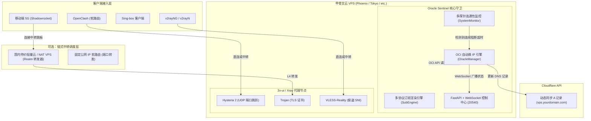

# 🛡️ VPSentinel (全能云端自愈守卫与订阅聚合枢纽)

<div align="center">


**支持 Oracle Cloud (甲骨文云)、搬瓦工、RackNerd、Hetzner、AWS、阿里云、腾讯云等任意 Linux VPS 的自动化自愈、多通道告警与全客户端订阅聚合中枢**

[](LICENSE)
[](https://www.python.org/)
[](https://fastapi.tiangolo.com)
[](https://docs.oracle.com/en-us/iaas/Content/API/SDKDocs/pythonsdk.htm)
[](https://developers.cloudflare.com/api/)
[](https://ui.shadcn.com/)

[功能特性](#功能特性) • [系统架构](#系统架构) • [前置准备](#前置准备) • [极速部署](#极速部署) • [多渠道通知](#多渠道通知) • [配置文件详解](#配置文件详解) • [订阅引擎与客户端适配](#订阅引擎与客户端适配) • [常见问题排查](#常见问题排查)

</div>

---

## 📖 项目简介

在长期使用境外 VPS 进行跨国业务部署、科学检索与节点分发时，常常面临四大核心痛点：
1. **IP 频繁被阻断（GFW 封锁）**：境外服务器暴露在公网，一旦 IP 被阻断，SSH 连不上、所有节点瘫痪，传统方案必须人工排查甚至花钱提工单换 IP。
2. **DNS 记录同步滞后**：手动换完 IP 后，需要前往 Cloudflare 重新修改解析 A 记录，期间往往经历数十分钟的不可用断网期。
3. **缺乏即时推送告警**：节点被封后管理员浑然不知，直到用户反馈才后知后觉。
4. **多协议客户端订阅维护繁重**：OpenClash、v2rayN、Sing-box、Shadowrocket 等客户端配置各异，遇到 OpenClash 的 DNS 递归死锁或 SNI 嗅探误分流时调试极其痛苦。

**VPSentinel** 诞生即为彻底终结上述痛点——它是一个轻量常驻守护进程 + 控制中心，具备**多云环境自适应识别**、**多探针连通性自愈**、**多通道阻断即时告警 (Telegram/Discord/Bark)**、**秒级无缝换 IP 并自动同步 Cloudflare DNS** 以及 **多客户端全能智能订阅引擎**。

---

<a id="功能特性"></a>
## ✨ 功能特性

### 1. 🌐 多云环境抽象与全能自愈（Multi-Cloud & Auto-Heal）
- **全平台宿主智能识别**：自动探测当前宿主机是 Oracle Cloud、AWS、阿里云、腾讯云、Hetzner 还是搬瓦工/RackNerd 等通用 VPS，并识别底层 CPU 架构 (`x86_64` / `aarch64`)。
- **三种自愈模式随心切换**：
  - **Oracle Cloud 模式**：内置 OCI SDK 自动化解绑与再申请，秒级释放被封 IP 并绑定全新可用公网 IP；
  - **通用 VPS 模式 (Generic VPS)**：专注于多节点国内探针监控、多渠道即时阻断告警与 WARP 双栈逃生；
  - **自定义 Hook 脚本模式**：支持调用任何云服务商 API 编写的换 IP 脚本进行联动。
- **Cloudflare DNS 无缝秒级同步**：获取全新 IP 后，自动化调用 Cloudflare API 刷新对应 A 记录，免去人工干预。

### 2. 📢 多渠道阻断告警中枢（Multi-Channel Alert Dispatcher）
- **开箱即用推送**：支持 **Telegram Bot**、**Discord Webhook**、**Bark (iOS)** 以及 **自定义 Webhook**；
- **智能告警事件**：在遭遇 GFW 阻断、换 IP 流程启动、Cloudflare DNS 同步完成或自愈失败时，毫秒级推送美化排版卡片至手机端；
- **控制台一键测试**：Web 控制台设置面板自带推送测试按钮，无需触发实际阻断即可秒级验证通道通畅度。

### 3. 📡 全能多协议智能订阅引擎（Visual Subscription Engine）
- **一源多出**：直接无缝桥接 3x-ui / X-UI 的 SQLite 数据库，自动提取 Hysteria 2、Trojan、VLESS-Reality 等协议节点。
- **全平台客户端原生适配**：
  - **Clash / OpenClash (Mihomo Meta)**：完整生成带有策略组（自动优选、故障转移、AI/流媒体分流、广告拦截）的标准 YAML。
  - **v2rayN / v2rayNG**：一键生成 Base64 订阅链接。
  - **Sing-box**：生成 1.8+ 标准 JSON 规则集配置。
  - **Shadowrocket (小火箭)**：标准节点链接合集。
- **专门针对 OpenClash 调优**：
  - 自动注入 `hosts` 映射与 `default-nameserver`，彻底消灭 OpenWrt 下解析节点域名的“死锁死循环”；
  - 注入面板端口（`20530`, `20540`）的 WAN 绕行规则，杜绝“代理自身管理面板导致无法访问”的死循环回环。
- **Hysteria 2 端口跳跃（Port Hopping）**：自动支持多端口绑定，有效破除国内运营商针对单一固定 UDP 端口的 QoS 封锁。

### 4. ⚡ 链式中转专线调度系统（Transit Relay Dispatcher）
- **国内节点/软路由一键中继**：支持将国内特价 NAT VPS、轻量服务器或具备固定公网 IP 的软路由作为跳板机。
- **Realm 极速 L4 转发集成**：内置自动生成 Realm 极速转发脚本，零 CPU 损耗实现内核级端口转发。
- **订阅动态重写**：后台添加中转机 IP/域名与端口后，订阅系统自动生成“中转加速”专用节点，客户端更新订阅即用。

### 5. 🎨 极简工业暗色仪表盘（Linear / Shadcn UI 风格）

<div align="center" style="margin: 16px 0;">
  
</div>

- **纯粹黑灰质感**：剔除任何浮夸动画，采用现代专业控制台暗黑风格，全量原生 Lucide SVG 矢量图标。
- **实时遥测监控**：CPU、RAM、磁盘、系统负载、WARP 双栈出口状态、公网 IP、延迟雷达 WebSocket 实时推送。
- **隐私马赛克滤镜 (`.privacy-blur`)**：如上方实拍截图所示，公网 IP 段、域名、WARP 节点等敏感字段默认高斯模糊遮罩，鼠标点击即可一键展开/隐藏，录屏分享零泄密风险。
- **内置 MetaCubeX 看板**：可随时进入内置的 WebUI 直观检查规则匹配与节点通断。

---

<a id="系统架构"></a>
## 🏗️ 系统架构



---

<a id="前置准备"></a>
## 📋 前置准备

在部署 Oracle Sentinel 之前，您需要准备以下环境：

### 1. Oracle Cloud 实例与 OCI API 密钥
1. 登录 [Oracle Cloud 控制台](https://cloud.oracle.com/)；
2. 进入右上角 **个人配置 (Profile) -> 用户设置 (User Settings) -> API 密钥 (API Keys)**；
3. 点击 **添加 API 密钥 (Add API Key)**，下载生成的私钥（`.pem` 文件），并复制页面显示的配置信息，例如：
   ```ini
   [DEFAULT]
   user=ocid1.user.oc1..aaaaaaaaxxxxxxx
   fingerprint=xx:xx:xx:xx:xx:xx:xx:xx
   tenancy=ocid1.tenancy.oc1..aaaaaaaaxxxxxxx
   region=us-phoenix-1
   key_file=/root/.oci/oci_api_key.pem
   ```
4. 将该内容保存在 VPS 的 `/root/.oci/config` 中，并将 `.pem` 密钥保存至对应路径。

### 2. Cloudflare API Token
1. 登录 [Cloudflare 控制台](https://dash.cloudflare.com/)；
2. 进入 **我的个人资料 -> API 令牌 (API Tokens) -> 创建令牌 (Create Token)**；
3. 选择 **编辑区域 DNS (Edit Zone DNS)** 模板；
4. 权限设置：`区域 (Zone) - DNS - 编辑`；
5. 记录下生成的 API Token（格式通常为 `cfut_...`）。

### 3. 3x-ui / X-UI
系统默认从 `/etc/x-ui/x-ui.db` 实时抓取节点凭证，请确保 VPS 已安装 `x-ui` 并创建好了所需的入站节点（如 Hysteria 2、Trojan、Reality）。

---

<a id="极速部署"></a><a id="快速安装"></a>
## 🚀 极速部署

### 方式一：Web 首次启动可视化配置向导（极力推荐，小白零门槛）

服务安装启动后，直接在浏览器中打开：
```text
http://<你的服务器IP>:20540/
```
首次访问时，系统将**全自动弹窗启动 6 步配置向导 (Web Onboarding Stepper)**，无需进入 SSH 敲命令，直接在现代感暗黑控制台中完成所有初始化工作：

1. **宿主环境智能体检**：自动识别云厂商（Oracle / AWS / 搬瓦工 / 腾讯云等）、CPU 架构（`x86_64` / `aarch64`）与公网 IPv4；
2. **运行模式自适应**：
   - **Oracle Cloud 模式**：点击按钮**一键生成 2048 位 RSA 密钥对**并在线打印公钥，直接粘贴甲骨文后台配置；
   - **通用 VPS 模式**：适用于搬瓦工、RackNerd、Hetzner、阿里云等普通 VPS，免去繁复 API，专注国内多探针监控、阻断告警与全能订阅；
   - **自定义 Hook 脚本模式**：高级玩家可指定自定义更换 IP 脚本命令；
3. **Cloudflare 域名秒级联动**：填入 API Token 点击“验证”，系统**自动在线拉取您名下的所有域名**供下拉选择，彻底杜绝手工拼写错误，实时预览解析记录；
4. **3x-ui 黄金出海节点一键入库**：自动向数据库注入 VLESS-Reality (:8443)、Hysteria 2 (:443 端口跳跃) 与 Trojan (:2083)，开箱即用；
5. **多渠道告警中心**：在线配置 Telegram、Discord 或 Bark，并可**现场点击“发送测试推送 🔔”**，手机立即接收排版卡片；
6. **一键启动守护**：点击保存后，Sentinel 自愈守护引擎即刻进入工作状态！

> 💡 **提示**：如果后续需要更改配置，随时可以在 Web 控制台右上角的【设置】面板中点击 **“重新运行 Web 部署向导 🚀”** 重新进入。

---

### 方式二：全自动极简交互式安装向导（终端 SSH 用户推荐）

如果您更习惯在终端直接完成配置，一键执行安装脚本：

```bash
curl -fsSL https://raw.githubusercontent.com/imprprpr/vpsentinel/main/scripts/install.sh | sudo bash
```

> [!TIP]
> **终端向导（CLI Setup Wizard）自动完成的任务**：
> 1. **全平台宿主识别与模式选择**：自动探测当前云厂商，支持甲骨文云（OCI 换 IP）、通用 VPS（搬瓦工/RackNerd/Hetzner 监控告警）与自定义 Hook 模式；
> 2. **自动放通底层防火墙阻断**：清理严苛的 iptables 规则，适配 UFW / firewalld，一键开启 Linux 原生 BBR 加速；
> 3. **自动配置 Hysteria 2 端口跳跃**：内核级 NAT 重定向（`UDP 20000:40000 -> 443`）；
> 4. **OCI API 密钥全自动化**：自动生成 2048 位标准 RSA 密钥对并排版打印，在终端直接粘贴甲骨文后台配置，免去格式错误烦恼；
> 5. **Cloudflare 域名自动拉取**：输入 Token 后自动验证并列出名下所有活跃域名供数字选择，全自动绑定/刷新 A 记录；
> 6. **SSL 证书静默自动签发**：基于 Cloudflare DNS-01 挑战协议，**无需占用 80/443 端口**，自动签发并挂载 ECC-256 证书；
> 7. **3x-ui 黄金主力节点一键注入**：自动生成 X25519 密钥对，一键向数据库写入 VLESS-Reality (:8443)、Hysteria 2 (:443 端口跳跃) 与 Trojan (:2083)，装完即出海！
> 8. **多渠道即时阻断告警中枢**：一键绑定 Telegram Bot、Discord Webhook 或 Bark，节点遭受阻断/自愈秒级推送卡片！

随时在终端重新运行向导：
```bash
sudo python3 /opt/vpsentinel/scripts/wizard.py
```

---

### 方式三：手动分步安装

```bash
# 1. 切换至管理员权限并克隆仓库
sudo -i
git clone https://github.com/imprprpr/vpsentinel.git /opt/vpsentinel
cd /opt/vpsentinel

# 2. 创建 Python 虚拟环境并安装依赖
python3 -m venv venv
./venv/bin/pip install --upgrade pip
./venv/bin/pip install -r requirements.txt

# 3. 运行交互式向导 (或手动配置)
python3 scripts/wizard.py

# 4. 注册并启动 Systemd 守护进程
cp systemd/vpsentinel.service /etc/systemd/system/
systemctl daemon-reload
systemctl enable --now vpsentinel

# 5. 查看运行状态
systemctl status vpsentinel
```

---

<a id="多渠道通知"></a><a id="多渠道阻断告警配置"></a>
## 📢 多渠道阻断告警配置

Sentinel 内置开箱即用的多渠道即时消息通知中心，支持在遇到国内探针丢包超标、触发自愈流程、换 IP 成功以及自愈失败时向管理员发送推送卡片。

### 支持渠道与配置方法：
1. **Telegram Bot**：
   - 向 [@BotFather](https://t.me/BotFather) 申请机器人并获取 `bot_token`；
   - 将 Bot 添加至私聊或告警群组，向 [@userinfobot](https://t.me/userinfobot) 获取你的 `chat_id`；
   - 在 Web 控制台右上角【设置】面板填入并开启，或运行交互式向导配置。
2. **Discord Webhook**：
   - 在 Discord 服务器频道设置 -> 整合 (Integrations) -> 创建 Webhook 并复制 URL；
   - 填入对应输入框并开启。
3. **Bark (iOS)**：
   - App Store 下载安装 Bark；
   - 复制 App 首页显示的 Device Key 填入即可实现 iOS 原生高优先级推送。
4. **一键测试**：
   - 在 Web 控制台设置面板中点击 **“发送测试推送 🔔”**，无需等待网络阻断即可实时验证推送可用性。

---

<a id="配置文件详解"></a>
## ⚙️ 配置文件详解

配置文件位于 `/opt/vpsentinel/config.json`：

```json
{
  "provider": {
    "type": "auto",
    "hook_cmd": ""
  },
  "cloudflare": {
    "api_token": "YOUR_CLOUDFLARE_API_TOKEN",
    "zone_name": "yourdomain.com",
    "record_name": "vps.yourdomain.com"
  },
  "oci": {
    "auth_method": "config_file",
    "config_path": "/root/.oci/config"
  },
  "monitor": {
    "interval_sec": 15,
    "loss_threshold": 75.0,
    "consecutive_failures": 3,
    "auto_heal_enabled": true
  },
  "notifications": {
    "enabled": true,
    "telegram": {
      "enabled": true,
      "bot_token": "123456789:ABCdefGhIJKlmNoPQRsTUVwxyZ",
      "chat_id": "987654321"
    },
    "discord": {
      "enabled": false,
      "webhook_url": "https://discord.com/api/webhooks/..."
    },
    "bark": {
      "enabled": false,
      "bark_key": "YOUR_BARK_DEVICE_KEY"
    },
    "custom_webhook": {
      "enabled": false,
      "url": "https://api.example.com/webhook"
    }
  },
  "rules_config": {
    "adblock": true,
    "ai_group": true,
    "media_group": true,
    "auto_test": true,
    "direct_cn": true,
    "hy2_hop": true
  },
  "transits": []
}
```

### 关键配置项说明：
- `provider.type`：云厂商自愈类型，可选 `auto`（智能探测）、`oracle`（甲骨文云）、`hook`（自定义脚本）或 `generic`（通用 VPS 仅告警）；
- `provider.hook_cmd`：当 `type` 为 `hook` 时触发换 IP 的本地 Shell 脚本绝对路径；
- `cloudflare.api_token`：具备 DNS 编辑权限的 Cloudflare API 密钥；
- `cloudflare.record_name`：绑定的动态解析域名（提前在 Cloudflare 解析至当前 VPS IP）；
- `oci.config_path`：OCI 官方 API 认证配置文件的本地路径；
- `monitor.interval_sec`：连通性探针巡检周期（默认 15 秒）；
- `monitor.loss_threshold`：判定为 GFW 阻断的丢包率阈值（%）；
- `monitor.consecutive_failures`：连续失败触发自愈的次数（例如连续 3 次探测均超过 75% 丢包率即触发自愈）；
- `notifications.enabled`：多渠道告警总开关，支持 Telegram、Discord、Bark 及自定义 Webhook 并发推送。

---

<a id="订阅引擎与客户端适配"></a>
## 📱 订阅引擎与客户端适配

启动后，访问 `https://<YOUR_DOMAIN>:20540/` 登录控制中心，在 **多协议订阅中心** 可直接复制各客户端专属链接：

| 客户端类型 | 订阅 URL | 特性优化 |
| :--- | :--- | :--- |
| **Clash / OpenClash** | `/sub/clash` | 自动注入防死锁 hosts、`default-nameserver`、国内分流、规则集直连绕行 |
| **v2rayN / v2rayNG** | `/sub/v2ray` | 标准 Base64 聚合节点池，支持一键更新 |
| **Sing-box** | `/sub/singbox` | 1.8+ 现代规范 JSON 配置，包含自动测速与 DNS 分流 |
| **Shadowrocket** | `/sub/shadowrocket` | 手机端专用扫码直入格式 |

### OpenClash 最佳实践与避坑重点

1. **防 DNS 递归死锁**：
   - OpenClash 会接管本地 Dnsmasq。如果客户端尝试解析你的节点域名 `vps.yourdomain.com`，而此时代理还没连上，极易产生死锁。
   - **Sentinel 的对策**：`/sub/clash` 在生成的配置顶部强制注入了静态映射：
     ```yaml
     hosts:
       'vps.yourdomain.com': '当前VPS真实公网IP'
     ```
2. **面板回环闭环防护**：
   - 在 OpenClash 插件后台中，请将 Sentinel 管理端口（`20540`）与 x-ui 管理端口（`20530`）加入 **“不走代理的 WAN 端口”** 列表中，避免管理流量误走代理进入死循环。

---

## ⚡ 链式中转专线调度

如果您有一台国内低延迟机器（如腾讯云/阿里云国内轻量 VPS、国内 NAT VPS 或具备公网 IP 的软路由）：

### 1. 一键部署中转机 Realm 转发器
在你的中转机器（跳板机）终端中执行：
```bash
curl -fsSL https://<YOUR_DOMAIN>:20540/scripts/setup-relay.sh | sudo bash -s -- vps.yourdomain.com
```
或者手动运行项目自带脚本：
```bash
sudo bash scripts/setup-relay.sh vps.yourdomain.com
```

### 2. 在控制中心登记中转节点
1. 访问控制中心仪表盘，切换至 **“中转与独立节点”** 面板；
2. 点击 **添加中转接入点**，填入你的中转机 IP / 域名以及对应端口；
3. 保存后，客户端刷新订阅即可看到新增的 `[中转] Hy2专线`、`[中转] Reality专线` 等加速节点。

### 3. 自定义独立原生节点聚合（Custom Standalone Nodes）
支持将任意外部原生 VPS 节点（如日本原生机、香港直连机等）聚合到同一个统一订阅中，自动参与客户端自动优选与智能分流：
- **Web 端录入**：在仪表盘 **“中转与独立节点”** 页面，点击 **“添加独立节点”**，粘贴分享链接（支持 `vless://` Reality、`hysteria2://`、`trojan://`、`ss://`）即可一键解析保存。
- **CLI 命令行录入**：
  ```bash
  python3 /opt/vpsentinel/scripts/add-custom-node.py "<节点分享链接>"
  ```
  查看已配置的独立节点列表：
  ```bash
  python3 /opt/vpsentinel/scripts/add-custom-node.py --list
  ```

---

## 🛠️ 常用维护命令

```bash
# 查看 VPSentinel 守护进程实时日志
journalctl -u vpsentinel -f

# 重启 VPSentinel 守护服务
systemctl restart vpsentinel

# 手动更新本地 Geo 规则集库 (GeoIP, GeoSite, MMDB)
sudo bash /opt/vpsentinel/scripts/update-geo.sh
```

---

<a id="常见问题排查"></a>
## ❓ 常见问题排查 (FAQ)

<details>
<summary><b>Q1: 自动换 IP 后，Cloudflare DNS 更新了，但本地客户端依然连不上？</b></summary>
本地系统的 DNS 缓存通常存在 TTL（通常在 1~5 分钟）。另外，如果使用了 OpenClash，OpenClash 内部的 DNS 缓存也可能残留旧 IP。
<b>解决办法</b>：Sentinel 生成的订阅中自带 hosts 直通，客户端只需点击“更新订阅”即可立刻获取最新 IP。
</details>

<details>
<summary><b>Q2: VLESS-Reality 节点为什么手机 v2rayNG 能用，但某些客户端测不出延迟？</b></summary>
部分客户端（如开启了 TLS 域名深度嗅探的 OpenClash）嗅探到伪装域名（如 <code>swdist.apple.com</code>）后，误判为直连规则将其分流到了国内苹果服务器，而国内苹果服务器并未开放 8443 端口导致连接超时。
<b>解决办法</b>：在客户端中将 VPS 的 IP 加入“直连绕过名单”或关闭对该端口的 SNI 嗅探。
</details>

<details>
<summary><b>Q3: 仪表盘中的公网 IP 和域名显示模糊？</b></summary>
这是我们专门设计的 <b>隐私保护滤镜 (`.privacy-blur`)</b>，以防止用户在截图、录屏或群内答疑时泄露敏感 IP 遭到定向 DDOS。只需用鼠标<b>单击对应字段</b>，即可平滑切换显示/隐藏状态。
</details>

<details>
<summary><b>Q4: 导入订阅后，软路由 OpenClash 中所有节点全部变黑（<code>---</code>）或连接被拒，但手机/电脑代理软件正常？</b></summary>

<b>故障原因</b>：
1. <b>回环 IP 污染</b>：在某些未正确初始化公网探针的环境下，订阅引擎若静默回退为 <code>127.0.0.1</code>，会导致生成的 Clash 配置中 <code>hosts</code> 与节点 <code>server</code> 指向本地回环地址。OpenClash 导入后将节点请求发往软路由本地，因无对应端口监听而直接拒绝连接（显示 <code>---</code>）。
2. <b>国内 DNS 投毒</b>：国内运营商或公共 DNS（如 <code>223.5.5.5</code>）对部分 DDNS 域名存在 DNS 污染（直接解析为 <code>127.0.0.1</code>）。若客户端依赖域名解析且未启用 hosts 覆写，会导致节点不可达。

<b>解决办法</b>：
* <b>服务端更新</b>：最新版本 VPSentinel 订阅引擎（v2.2.1+）已全面采用<b>真实公网 IP 直写机制</b>（<code>server: <Public_IP></code>），握手层彻底免除域名解析过程，并自动矫正 <code>hosts</code> 映射，彻底免疫国内 DNS 污染。
* <b>软路由操作</b>：打开 OpenClash 后台 -> 切换到<b>【配置订阅】</b> -> 点击对应订阅的<b>【更新配置】</b>并<b>【应用配置】</b>；随后在仪表盘（MetaCubeXD）中点击测速即可瞬间点亮所有绿色延迟。
</details>

<details>
<summary><b>Q5: 软路由 OpenClash 节点测速正常（延迟 100+ms 绿色），但内网所有电脑与手机完全无法上网（报连接超时）？</b></summary>

<b>故障原因</b>：
* <b>典型 Fake-IP 分流自环黑洞</b>：如果分流规则集中误包含了 <code>IP-CIDR, 198.18.0.0/15, 🎯 全球直连, no-resolve</code>，由于 <code>198.18.0.1/16</code> 是 Clash / OpenClash 体系的<b>专用 Fake-IP 虚拟地址池</b>，内网设备访问外网域名（如 Google、YouTube）时，DNS 会首先为该域名映射一个 <code>198.18.x.x</code> 的虚拟 IP。
* 当请求数据包到达软路由内核时，该规则带有 <code>no-resolve</code>（禁止域名反查还原），软路由将虚拟 IP 强行当作真实国内物理 IP 分流到 <b>DIRECT 直连发往 WAN 口运营商光猫</b>。国内宽带网关无法路由此保留网段，导致全屋所有外网流量全被丢入黑洞死循环。

<b>解决办法</b>：
* <b>规则修正</b>：从分流规则中彻底清除任何针对 <code>198.18.0.0/15</code> 的直连规则。VPSentinel 订阅库已在最新版中剔除此规则，并在配置中加入了海外安全 DoH 递归解析（<code>https://1.1.1.1/dns-query</code> 与 <code>https://8.8.8.8/dns-query</code>）。
* 在 OpenClash 中重新点击<b>【更新配置】</b>并保存生效即可，内网所有终端设备立即恢复正常访问。
</details>

<details>
<summary><b>Q6: 在 64MB / 128MB 极小内存容器（Podman / Alpine / LXC 容器）部署外部节点时频繁 OOM 闪退？</b></summary>

<b>故障原因</b>：
1. <b>解压内存突发峰值</b>：通过管道并发 <code>curl ... | tar -xz</code> 直接在 tmpfs 内存流式解压 <code>sing-box</code> 二进制核心时，短时间内会产生 60MB+ 的解压内存尖峰，直接击穿 64MB 限制并触发 Linux 内核 cgroup OOM Killer 强杀容器。
2. <b>Go 运行时 GC 水位偏高</b>：默认情况下 Go 运行时不会主动压制堆内存，在小规格容器内容易超出 cgroup 内存限额。

<b>解决办法</b>：
* <b>串行磁盘落地</b>：使用最新部署脚本 <code>scripts/setup-japan-node.sh</code>，脚本采用分段下载至磁盘物理目录后就地提取，杜绝内存 tmpfs 膨胀。
* <b>自动 Swap 兜底</b>：脚本自动检测宿主可用内存，在内存低于 128MB 的环境下自动创建并挂载 256MB 虚拟内存盘。
* <b>强制内存水位限制</b>：在后台守护进程启动环境中注入 <code>GOMEMLIMIT=40MiB</code> 与 <code>GOGC=50</code>，强制垃圾回收器在内存达到 40MB 前完成主动清理，确保在 64MB 极限小鸡上长期常驻稳定运行。
</details>

<details>
<summary><b>Q7: NAT VPS（共享 IP、端口映射机）部署外部节点后，客户端扫码无法连接？</b></summary>

<b>故障原因</b>：
* NAT 主机对外仅开放特定的端口段映射（例如内部监听 <code>28443</code>，外部公网映射端口为 <code>26554</code>）；且服务器本地网卡 IP 通常为局域网地址（如 <code>10.x.x.x</code>），直接生成分享链接会导致客户端尝试连接错误的私有 IP 或内部端口。

<b>解决办法</b>：
* 部署脚本原生支持外部参数透传，在部署时显式指定公网 IP 和映射端口：
  ```bash
  EXT_IP="85.113.70.183" EXT_PORT="26554" bash scripts/setup-japan-node.sh
  ```
* 随后在 VPSentinel 仪表盘【外部节点】或使用 CLI（<code>python3 scripts/add-custom-node.py "&lt;分享链接&gt;"</code>）导入时，系统会自动持久化公网端点，并自动分发至所有 Clash / Sing-box / V2Ray 聚合订阅中。
</details>

<details>
<summary><b>Q8: 国内直连更新订阅或解析 DDNS 域名被劫持为 <code>127.0.0.1</code>？</b></summary>

<b>故障原因</b>：
* GFW 对部分免费/二级域名后缀（如 <code>*.ccwu.cc</code>）实施了 DNS 投毒，使用国内公共 DNS 解析时被强行篡改为回环地址 <code>127.0.0.1</code>。

<b>解决办法</b>：
1. <b>IP 直连优先</b>：VPSentinel 订阅生成的节点已默认直连公网 IP，握手层仅保留 TLS SNI 伪装标头，完全绕过国内 DNS 污染链路。
2. <b>本地 Hosts 固化</b>：若需要国内网络直连订阅 API（<code>https://&lt;domain&gt;:20540/sub/clash</code>），可在软路由的<b>【Hosts 覆写】</b>或本地系统的 <code>/etc/hosts</code> 中手动固定解析记录：
   ```text
   <Oracle_VPS_公网IP>  <你的DDNS域名>
   ```
3. <b>推荐使用主流顶级域名</b>：如 <code>.com</code>、<code>.net</code>、<code>.xyz</code> 并由 Cloudflare 托管，并开启 DNSSEC 增强解析安全性。
</details>

---

## 📄 开源许可证

本项目基于 [MIT License](LICENSE) 开源发布，欢迎自由 Star、Fork 与提交 Pull Request！
